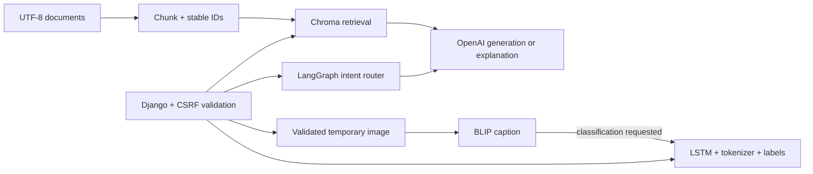

# Multi-Capability AI Assistant

A Django interface for four separate workflows: LangGraph Python generation/explanation,
Chroma document RAG, LSTM text classification, and BLIP image captioning. Each has its own
dependency/artifact requirements and failure boundary; the web application can start without
downloading models or requiring a provider key.



## Setup

```bash
python -m venv .venv
source .venv/bin/activate  # Windows: .venv\Scripts\activate
pip install -r requirements.txt ruff
python manage.py migrate
python manage.py runserver
```

This lightweight setup starts the UI and error paths. Install `requirements-ai.txt` only for
the AI features you intend to run. Export the values in `.env.example`; the file is not
implicitly loaded. Provider generation and embeddings can incur charges. The provider adapter
retains the existing model default and uses the [official Chat Completions contract](https://developers.openai.com/api/reference/python/resources/chat/subresources/completions/methods/create).

### Documents

```bash
python manage.py ingest_documents examples/reference.txt
```

Chroma is a useful local persistent vector store here. Document chunks carry source filenames
and deterministic SHA-256 IDs, so repeated ingestion upserts the same records. Q&A retrieves
up to three chunks above a relevance threshold, returns source/context metadata, and abstains
when retrieval is empty. The generated vector store is ignored by Git.

### Local models

The missing legacy LSTM was recovered from `Quantization_Cellula_Week_2/code.rar`.
Its tokenizer and label encoder matched the existing files byte-for-byte. The verified
5.3 MB native Keras model, JSON tokenizer, nine ordered labels, and conversion provenance
are in `models/`. Serving no longer unpickles the tokenizer/labels. The trusted legacy
conversion script is `scripts/convert_legacy_artifacts.py`; legacy H5 copies stay ignored.
Install TensorFlow 2.21.0 for the tested local runtime. BLIP is downloaded only on first caption
use and cached in process. Caption-only mode does not invoke the classifier.

Real native-model inference validates finite, normalized nine-class probabilities and
returns an artifact-derived version and measured latency. A real failure case is
`How can I stay safe online?`, which the recovered model labels `Violent Crimes`.
This demonstrates a working serving path, **not a reliable moderation model**. Mixed
`Safe`, `unsafe`, and specific harm-category labels need a taxonomy review and separate
query-only versus query-plus-caption evaluation before use beyond this demo.

## Reliability and security

Text requests are bounded to 10000 characters. CSRF protection is enabled. Images are checked
with Pillow, limited to 5 MB, saved under a random temporary name, and deleted in a finally
block. User-controlled filenames are never used as filesystem destinations. Service failures
are logged and return safe HTTP 503 responses; validation failures return 400.

`/assistant/health/` reports liveness, provider configuration, and whether classifier artifacts
exist. It does not claim that provider credentials work or model quality is adequate. Generated
Python is syntax-checked but never executed. Syntax validity is not correctness or safety.

## Test

```bash
ruff check assistant smart_assistant_project task0.py
ruff format --check assistant smart_assistant_project task0.py
python manage.py check
python manage.py test assistant
```

Tests cover chunking, stable ingestion IDs, retrieval provenance, empty retrieval, intent
routing, Python syntax, startup without credentials, CSRF, invalid uploads, missing-model
failure, and a mocked code request. GitHub Actions has lightweight tests and a separate native
LSTM job, with no paid APIs. Live provider, Chroma embedding, BLIP inference, and LSTM quality
are not claimed as verified. SQLite stores Django framework state only; no new relational database, orchestrator,
Docker deployment, or cloud service is justified at this stage.
